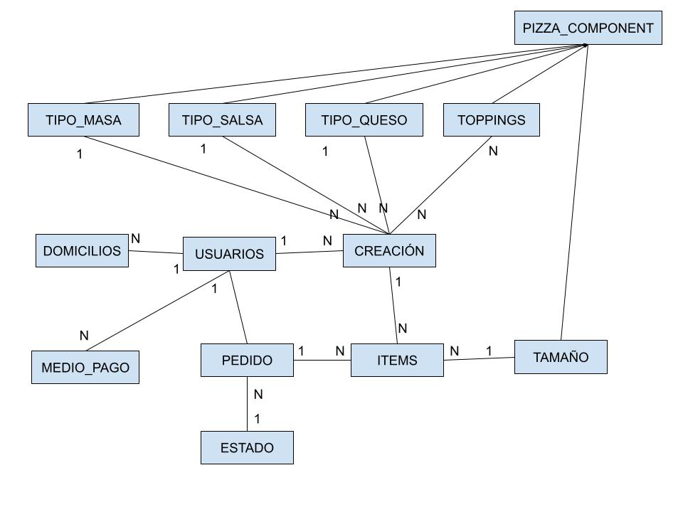

# spring-pizzahurt


## Proyecto obligatorio final. Curso: Desarrollo de aplicaciones con Spring / Spring Boot
- Universidad ORT
- Agosto 2023 - Octubre 2023

### Autores
- Fourment, Juan
- Navarro Gutiérrez, Nicolás
- Ortuzar, Martín

### Docente
- Juan Larrayoz

## Descripción del proyecto
El objetivo de este proyecto la implementación de un sistema para satisfacer las necesidades de una pizzería, desarrollando un sistema de pedidos en línea funcional utilizando Spring Boot y tecnologías relacionadas como JPA y Thymeleaf.

El frontend está realizado con Spring MVC + Thymeleaf + HTML + Bootstrap con backend en Spring Boot v3.1.3. Cabe destacar que también se utilizó thymeleaf-extras-springsecurity6 para la seguridad en las páginas. La utilización de Bootstrap hace que el sitio sea responsive.

En cuanto a seguridad, mencionar que se aplica csrf para evitar el cross site.

La persistencia se realiza en memoria en la base de datos H2.

## Requerimientos funcionales implementados
- Autenticación de usuarios
- Registro de usuarios nuevos
- Creación de pizzas
- Realizar pedidos de las creaciones del usuario en líena
- Añadir medios de pago al usuario
- Añadir domicilios al usuario
- Servicios REST para interoperabilidad
    - Login de usuario
    - Registro de nuevo usuario
    - Listar medios de pago de un usuario
    - Ingresar nuevo medio de pago al usuario

Así mismo, para cada una de las entidades se realizaron implementaciones de Bean Validation además de implementar Spring Security para asegurar los request.

## Requerimientos no funcionales para ejecutar la aplicación
El equipo donde se ejecutará la aplicación debe contar con la plataforma Java (JVM / JRE) versión 17 o superior.

Para cargar el proyecto de código, es necesario contar con las herramientas de Maven. En el repositorio git se dejan los wrappers.

## Diagrama de entidades



## Iniciar el sistema
### Opción 1
1. Dentro del repositorio git  en rama __main__, descargar el archivo pizzahurt-1.0.jar
2. Ingrese en el directorio donde descargó el archivo anterior y abra una consola (cmd o powershell)
3. Estando en el directorio, escriba el siguiente comando: __java -jar pizzahurt-1.0.jar__
4. Abra un navegador web e ingrese en el enlace:  para poder operar con el sistema.

### Opción 2
Para esta opción se recomienda tener instalado las herramientas de Maven.
1. Realice un git clone del repositorio 
2. Inicie una terminal e ingrese en el directorio del repositorio.
3. Ejecute el siguiente comando __mvn spring-boot:run__
4. Abra un navegador web e ingrese en el enlace:  para poder operar con el sistema.

### Opción 3
Para esta opción necesitará de un IDE de desarrollo integrado como Intellij IDEA, NetBeans o Eclipse.
1. Realice un git clone del repositorio 
2. Abra alguno de los IDE mencionados anteriormente.
3. Dentro del IDE, selecciones la opción de _Abrir Proyecto_ y seleccione el directorio del proyecto.
4. Inicie el programa con la opción _RUN_ del IDE.
5. Abra un navegador web e ingrese en el enlace:  para poder operar con el sistema.

## Utilización de la aplicación

### Datos precargados
Al iniciar la aplicación se precargarán los datos acerca de los Tipos de Masa, Tipos de Salsa, Tipos de Quesos y Tamaños, además de un par de usuarios (con sus datos de domicilio y medios de pagos) que se describirán más adelante.

Los datos son precargados en el Bean CommandLineRunner initDatabase(...) en la clase InitDB.java

### Inicio de sesión
Al ingresar en el  del sistema, se presentará la pantalla de Login, donde se pide un email y contraseña.
Para iniciar sesión, se puede crear un usuario nuevo (haciendo click en el botón "Registrarse") o iniciar sesión con los siguientes usuarios:
- usuario@mail.com / password2023
- juan.larrayoz@gmail.com / password2023

El primer usuario cuenta con un domicilio, un medio de pago y una "Creación" de pizza, lo cual este usuario permite realizar un pedido sin necesidad de ingresar los datos de una Creación, domicilio y medio de pago.

Por otra parte, el segundo usuario no cuenta con información ingresada.

### Creaciones
La página principal cuando un usuario inicia sesión es la lista de creaciones. Aquí podrá modificar, eliminar o agregar nuevas "Creaciones".
Al agregar una creación, se solicitará ingresar un nombre y seleccionar los disttintos tipos de masa, salsa, queso y topings.

### Ingresar un domicilio y medio de pago
En la barra de menú superior, seleccionar el menú "Mi perfil" y hacer click en cualquiera de las opciones de "Domicilios" o "Medios de pago". Se navegará a una página donde se mostrarán todos los domicilios o medios de pago ingresados. Para añadir, presione el botón de "Agregar" y se mostrará un formulario que deberá completar con los datos solicitados.

### Pedidos
En la sección de "Mis pedidos" se podrán ver todos los pedidos y el estado de los mismos.

Al realizar un nuevo pedido, este estará en estado pendiente hasta que se termine el proceso.

El proceso de realizar un pedido comienza seleccionando las creaciones, el tamaño y la cantidad de pizzas y se debe agregar al "pedido". Se pueden agregar tantas como el usuario lo desee. Cada vez que se agrega un nuevo item al pedido, del lado derecho aparecerá el detalle de cada uno de estos, mostrando el total a pagar.

Luego de ingresar los items, se deberá presionar el botón "Siguiente" para seleccionar el domicilio de envio.

Posteriormente, se deberá seleccionar alguno de los domicilios ingresados para realizar la entrega del pedido. También se cuenta con la posibilidad de volver para atrás y continuar añadiendo items al pedido.

Después de seleccionar el domicilio, se deberá continuar para seleccionar uno de los medios de pago ingresados. También se cuenta con la posibilidad de volver para atrás y cambiar el domicilio o los items.

Una vez finalizado el pedido, éste quedará en estado ENVIADO, cerrando el ciclo en lo que refiere a la realización de un pedido.


### Licencia
- NO LICENCE

## API REST

### Endpoint para crear medio de pago

**URL** 

POST [localhost:8080/api/nuevomediodepago/{usuarioId}](README.md)

**Descripción**

Este endpoint permite a los usuarios agregar un nuevo medio de pago a su cuenta. Los detalles del medio de pago se envían en el cuerpo de la solicitud en formato JSON.

**Parámetros de solicitud**

* _usuarioId_ (int): El ID del usuario al que se asociará el medio de pago.

**Cuerpo de la solicitud**

* _emisor_tarjeta_ (string): El emisor de la tarjeta
* _numero_de_tarjeta_ (string): El número de la tarjeta de crédito.
* _cvv_ (string): El cvv de la tarjeta.
* _fecVtoForm_ (string): Fecha de vencimiento de la tarjeta.

```json
{
    "emisor_tarjeta": "mastercard",
    "numero_de_tarjeta": "5111111111111118",
    "cvv": "125",
    "fecVtoForm": "08/30"
}
```


**Respuesta exitosa**

* Código de estado: _201 (Creado)_
* Respuesta: Los mismos datos del medio de pago que se enviaron en la solicitud.

**Ejemplo de respuesta**

```json
{
    "emisor_tarjeta": "mastercard",
    "numero_de_tarjeta": "5111111111111118",
    "cvv": "125",
    "fecVtoForm": "08/30"
}
```

### Endpoint para Obtener Medios de Pago

**URL** 

GET [localhost:8080/api/mediosdepago/{usuarioId}](README.md)

**Descripción**

Este endpoint permite a los usuarios obtener un listado de sus medios de pago asociados. El ID del usuario se pasa como parámetro en la URL.

**Parámetros de solicitud**

_usuarioId_ (int): El ID del usuario para el cual se desea obtener la lista de medios de pago.

**Respuesta exitosa**

Código de estado: _200_ (OK)
Respuesta: Un listado de medios de pago del usuario en formato JSON.

**Ejemplo de respuesta**

```json
[
    {
    "emisor_tarjeta": "Visa",
        "numero_de_tarjeta": "4005550000000001",
        "cvv": "123",
        "fecVtoForm": "05/25"
    },
    {
        "emisor_tarjeta": "mastercard",
        "numero_de_tarjeta": "5111111111111118",
        "cvv": "125",
        "fecVtoForm": "08/30"
    }
]
```

### Endpoint para Registrar Usuario

**URL**

POST [localhost:8080/api/registrarse](README.md)

**Descripción**
Este endpoint permite a los usuarios registrarse en la aplicación proporcionando los detalles necesarios. La información del usuario se envía en el cuerpo de la solicitud en formato JSON.

**Cuerpo de la solicitud**

* _password_ (string): La contraseña del usuario.
* _telefono_ (string): El número de teléfono del usuario.
* _nombre_ (string): El nombre completo del usuario.
* _email_ (string): La dirección de correo electrónico del usuario.

```json
{
    "password": "12345678910",
    "telefono": "098989898",
    "nombre": "Pepe Argento",
    "email": "pepe@gmail.com"
}
```

**Respuesta exitosa**

Código de estado: _201_ (Creado)
Respuesta: Los datos del usuario recién registrado en formato JSON.

**Ejemplo de respuesta**

```json
{
    "email": "pepe@gmail.com",
    "nombre": "Pepe Argento",
    "password": "$2a$10$7ddS.gxv0TbcFi5Y1zHEKe.W5bo/Vc7R3m.xy55I14letkk98syxS",
    "telefono": "098989898",
    "username": "Pepe Argento"
}
```

### Endpoint para Iniciar Sesión

**URL**

POST [localhost:8080/api/login](README.md)

**Descripción**
Este endpoint permite a los usuarios iniciar sesión en la aplicación proporcionando su dirección de correo electrónico y contraseña. La información de inicio de sesión se envía en el cuerpo de la solicitud en formato JSON.

**Parámetros de solicitud**

El cuerpo de la solicitud debe contener los siguientes campos:

* _email_ (string): La dirección de correo electrónico del usuario.
* _password_ (string): La contraseña del usuario.

```json
{
    "email": "usuario@mail.com",
    "password": "password2023"
}
```

**Respuesta exitosa**

* Código de estado: _200_ (OK)
* Respuesta: La respuesta incluye la identificación de la sesión (sessionId) en texto plano.
  
**Ejemplo de respuesta:**

`sessionId: 0D4FBED01D7D855C8C25FBC63BEFDBE6`

## Reflexiones finales
La implementación de este proyecto implicó la aplicación práctica de todo lo aprendido durante el curso, así como una investigación exhaustiva para profundizar en los temas. Esto tenía el propósito de ampliar nuestra base de conocimientos y poder aplicarla de manera efectiva en este trabajo.

El uso de la última versión de Spring representó un desafío significativo para nosotros, ya que esta versión difería de la que habíamos utilizado en el curso. Esto nos obligó a enfrentar los retos asociados con las actualizaciones de software.

Por otra parte, habría sido gratificante para nosotros implementar JSON Web Tokens (JWT) en los servicios REST, ya que es una tecnología ampliamente adoptada en la industria y proporciona un nivel adicional de seguridad. Además, la implementación de tablas con paginación es otro aspecto que, lamentablemente, no pudimos incorporar debido a las restricciones de tiempo que enfrentamos.


